# bing-mediator

🌟 基于微软 New Bing 平台，利用 Vue3 和 Go 进行简单的定制，搭建了一个演示站点。该站点 UI 设计一致，支持 ChatGPT 提示词，国内可用，基本兼容微软 Bing AI 所有功能，无需进行登录即可实现畅聊。

如果 Bing 官方聊天服务器无法使用，可以考虑采用以下解决方案：

1. 通过 ModHeader 添加 X-Forwarded-For 请求头，对应 URL 是 wss://sydney.bing.com/sydney/ChatHub。

2. 通过本地部署的方式，再部署一份作为聊天中转服务，或者直接下载 Release 程序运行，自定义聊天服务器中填入 http://localhost:8080，并进行选择。

🌟 聊天服务器采用 Cloudflare Workers 实现，每日请求数限额为 100,000 次，难以持续使用。建议自行部署，参考以下[部署聊天服务器](#部署聊天服务器)内容。在右上角设置中，可以通过“服务选择”进行聊天服务器的切换。

🌟 该站点能够在国内使用，要求部署服务器需要直连 www.bing.com，且不进行重定向 CN。此外，它还支持现有开源 ChatGPT 提示词库。当需要实现高级功能，如画图时（需要选择更有创造力模式或右上角设置中的“图像创建”），可登录微软账号设置用户 Cookie，以提升用户体验。

🌟 遇到任何问题，用户可以首先单击左下角“新主题”图标尝试解决。如果不行，可以采用清空缓存（Shift + F5 或 Ctrl + Shift + R 或右上角设置中的一键重置）。若仍有问题，可以通过清理浏览器缓存及 Cookie（例如24小时限制、未登录提示等）进行解决。

## 演示站点

- https://www.thirdgpt.com

### Vercel 搭建

- https://bing-vercel.thirdgpt.com

- https://bing-mediator-kirklin.vercel.app

### Render 搭建

- https://bing-render.thirdgpt.com

- https://bing-mediator.onrender.com

## 网页展示

- 电脑端未登录状态

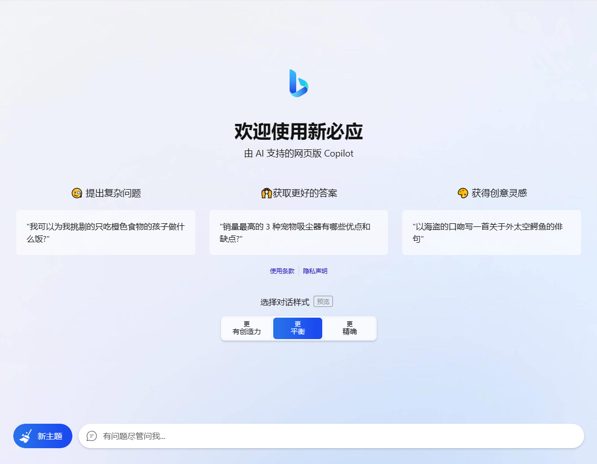

- 电脑端登录


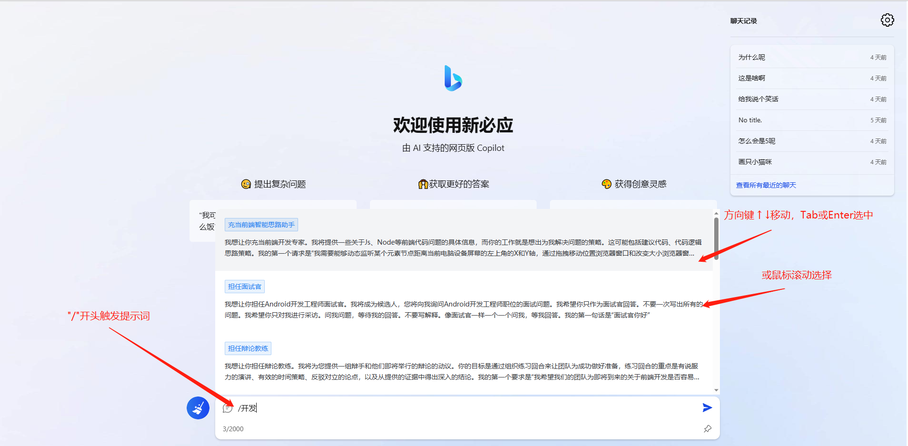
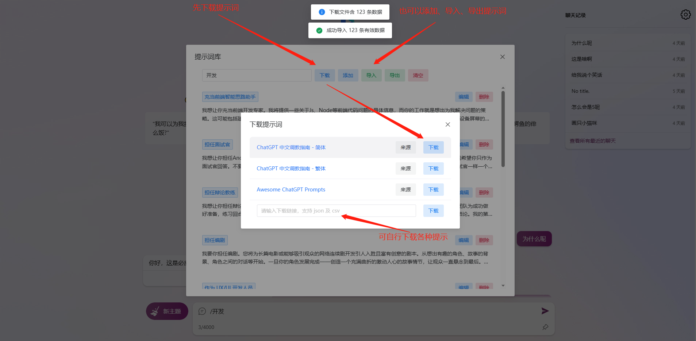
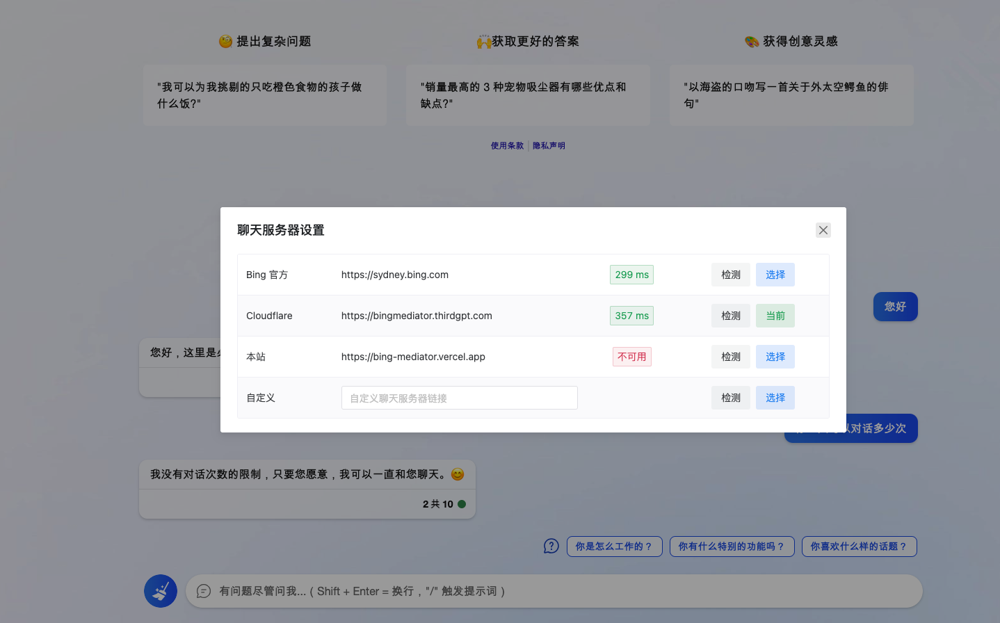

- 电脑端画图

> 🌟 需登录，并选择 更有创造力 对话模式


- 手机端未登录状态


## 侧边栏

- 在 Edge 浏览器可把聊天和撰写分别添加侧边栏

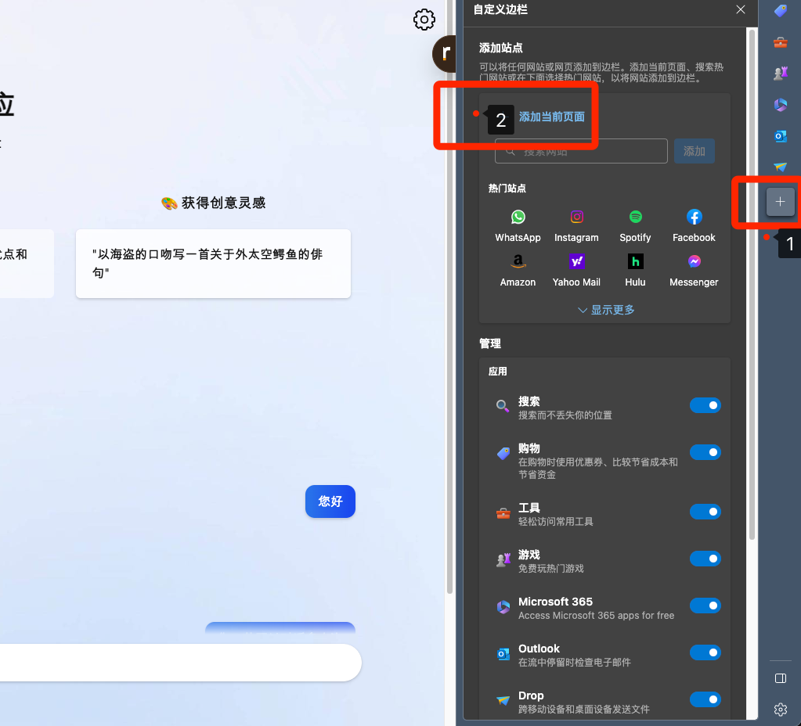

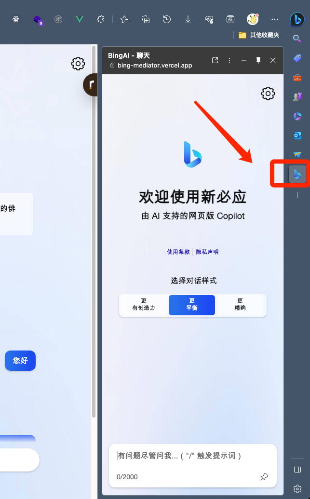


## 设置用户

- 访问 https://www.bing.com/ 或 https://cn.bing.com/ ，登录

- F12 或 Ctrl + Shift + I 打开控制台

- 拿到 Cookie 中 _U 的值 后，在网站设置 => 设置用户 中填入即可。

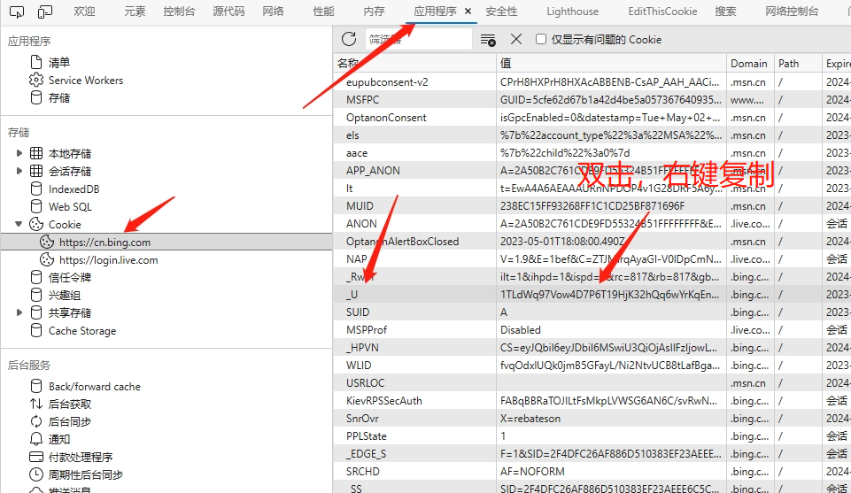

## 环境变量

```bash
# 运行端口 默认 8080 可选
PORT=8080
# Socks 环境变量 示例 可选
BING_MEDIATOR_SOCKS_URL=192.168.0.88:1070
# Socks 账号、密码 可选
BING_MEDIATOR_SOCKS_USER=xxx
BING_MEDIATOR_SOCKS_PWD=xxx
# 默认用户 Cookie 设置，可选，不推荐使用，固定前缀 BING_MEDIATOR_USER_TOKEN 可设置多个，未登录用户将随机使用，多人共用将很快触发图形验证，并很快达到该账号的24小时限制
BING_MEDIATOR_USER_TOKEN_1=xxx
BING_MEDIATOR_USER_TOKEN_2=xxx
BING_MEDIATOR_USER_TOKEN_3=xxx ...
# 简单授权认证密码，可选
BING_MEDIATOR_AUTH_KEY=xxx
```

## 部署

> 🌟 需 https 域名 (自行配置 nginx 等) (前后端都有限制 只有在HTTPS的情况下，浏览器 Accept-Encoding 才会包含 br , localhost 除外)

> 支持 Linux (amd64 / arm64)、Windows (amd64 / arm64)

> 国内机器部署可配置 socks 环境变量

### Docker

> 参考 [Dockerfile](./docker/Dockerfile) 、[docker-compose.yml](./docker/docker-compose.yml)

- docker 示例

```bash
# 运行容器 监听8080 端口
docker run -d -p 8080:8080 --name bing-mediator --restart=unless-stopped kirklin/bing-mediator

# 配置 socks 环境变量
docker run -e BING_MEDIATOR_SOCKS_URL=192.168.0.88:1070 -e BING_MEDIATOR_SOCKS_USER=xxx -e BING_MEDIATOR_SOCKS_PWD=xxx -d -p 8080:8080 --name bing-mediator --restart=unless-stopped kirklin/bing-mediator
```

- docker compose 示例

```yaml
version: '3'

services:
  bing-mediator:
    # 镜像名称
    image: kirklin/bing-mediator
    # 容器名称
    container_name: bing-mediator  
    # 自启动
    restart: unless-stopped
    ports:
      - 8080:8080
    # environment:
    #   - BING_MEDIATOR_SOCKS_URL=192.168.0.88:1070
    #   - BING_MEDIATOR_SOCKS_USER=xxx
    #   - BING_MEDIATOR_SOCKS_PWD=xxx
    #   - BING_MEDIATOR_USER_TOKEN_1=xxx
    #   - BING_MEDIATOR_USER_TOKEN_2=xxx    
```

### Release

在 [GitHub Releases](https://github.com/kirklin/bing-mediator/releases) 下载适用于对应平台的压缩包，解压后可得到可执行文件 bing-mediator，直接运行即可。

### Vercel

> 🌟 Vercel 部署不支持 Websocket ，需选择 官方聊天服务器 或 Cloudflare

一键部署，点这里 => [](https://vercel.com/new/clone?repository-url=https://github.com/kirklin/bing-mediator&project-name=bing-mediator&repository-name=bing-mediator-vercel)

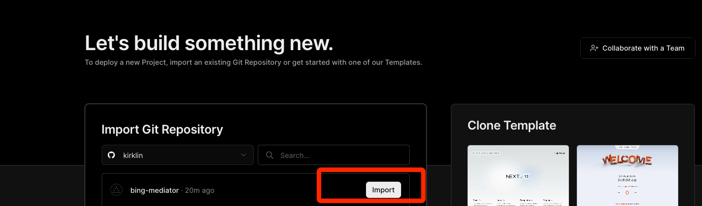

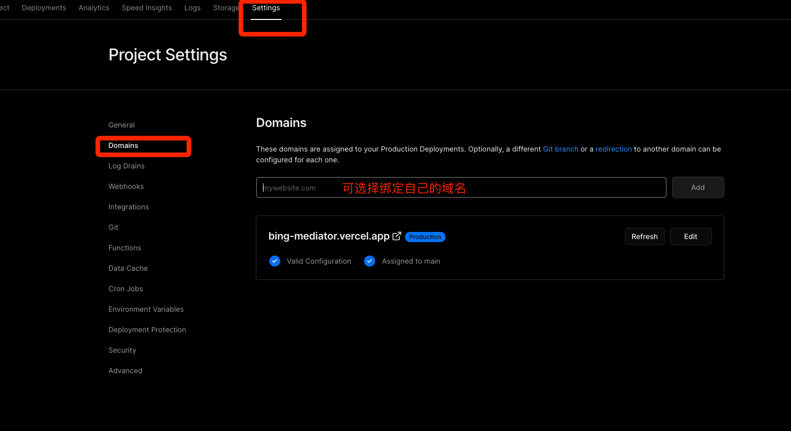

### Render

一键部署，点这里 => [](https://render.com/deploy?repo=https://github.com/kirklin/bing-mediator)

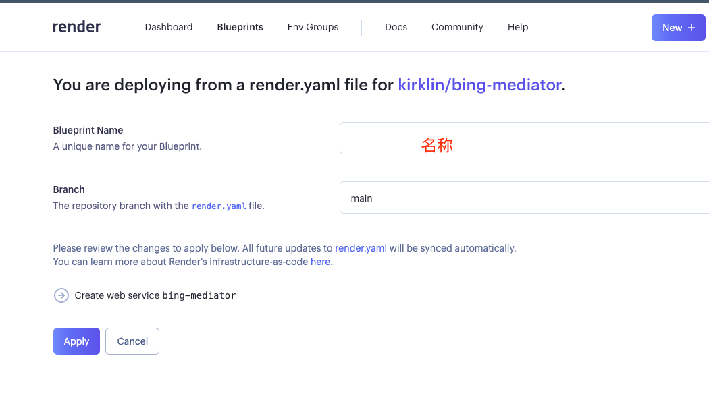

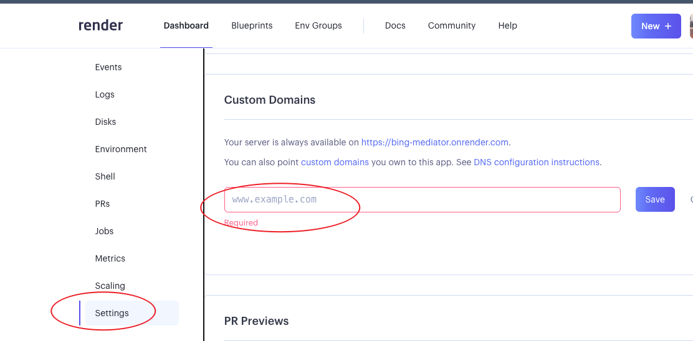

## 部署聊天服务器

> 核心代码 [worker.js](./cloudflare/worker.js)

> 具体部署 Cloudflare Workers 教程自行查询，大概如下

- [注册 Cloudflare 账号](https://dash.cloudflare.com/sign-up)

- 创建 Worker 服务，复制 [worker.js](./cloudflare/worker.js) 全部代码，粘贴至创建的服务中，保存并部署。

- 触发器 中自定义访问域名。
